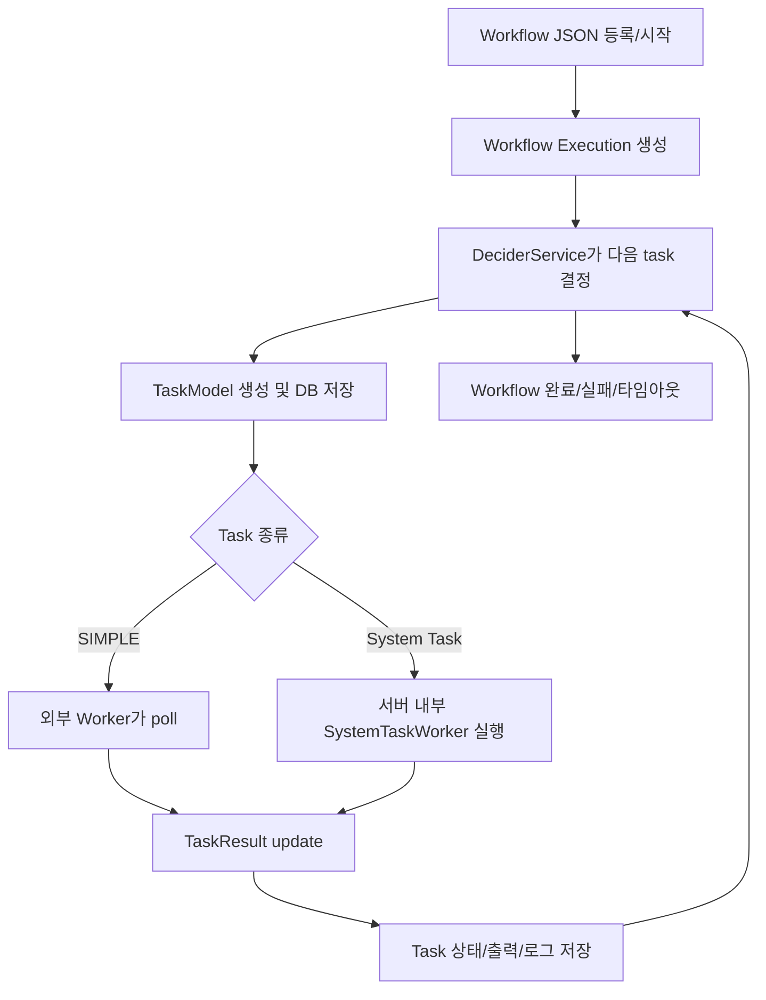

# Conductor Agent Orchestration 정리

이 문서는 `conductor-oss/conductor` 저장소의 문서와 주요 소스 코드를 읽고, Conductor가 어떻게 작동하는지와 agent orchestration을 어떻게 구성하는지 쉽게 정리한 내용입니다.

대상 저장소:

- GitHub: https://github.com/conductor-oss/conductor
- 문서: https://github.com/conductor-oss/conductor/tree/main/docs
- AI 모듈: https://github.com/conductor-oss/conductor/tree/main/ai

## 1. Conductor는 무엇인가

Conductor는 Netflix에서 시작된 오픈소스 workflow orchestration engine입니다. 현재 `conductor-oss/conductor` 저장소에서는 microservice workflow뿐 아니라 AI agent, LLM, MCP tool, A2A agent까지 실행할 수 있는 durable workflow engine으로 확장되어 있습니다.

쉽게 말하면 Conductor는 다음 일을 합니다.

```text
작업 순서를 정의한다
각 작업의 상태를 저장한다
실행할 작업을 queue에 넣는다
worker 또는 system task가 작업을 실행한다
결과를 저장한다
다음 작업을 결정한다
실패하면 retry/timeout/failure workflow를 처리한다
```

Conductor는 LLM agent framework라기보다는, agent가 수행해야 할 여러 단계를 안전하게 실행하고 복구할 수 있게 만드는 orchestration runtime에 가깝습니다.

## 2. 핵심 개념

### Workflow Definition

Workflow definition은 실행 설계도입니다. JSON으로 작성되며 어떤 task를 어떤 순서로 실행할지 정의합니다.

예를 들면:

```json
{
  "name": "process_order",
  "version": 1,
  "tasks": [
    {
      "name": "fetch_order",
      "taskReferenceName": "fetch_order",
      "type": "HTTP"
    },
    {
      "name": "fulfill_order",
      "taskReferenceName": "fulfill_order",
      "type": "SIMPLE"
    }
  ]
}
```

Workflow definition에는 다음 정보가 들어갑니다.

- workflow 이름과 버전
- input/output parameter
- task 목록
- timeout policy
- failure workflow
- restart 가능 여부
- owner 정보

관련 문서:

- `docs/devguide/concepts/workflows.md`

### Workflow Execution

Workflow execution은 실제 실행 인스턴스입니다. 같은 workflow definition을 여러 번 실행하면 각각 고유한 workflow ID를 가진 execution이 만들어집니다.

주요 상태는 다음과 같습니다.

```text
RUNNING
COMPLETED
FAILED
TIMED_OUT
TERMINATED
PAUSED
```

### Task

Task는 workflow 안의 한 단계입니다.

Conductor task는 크게 세 종류로 볼 수 있습니다.

```text
System Task
Worker Task
Operator
```

System task는 Conductor 서버 내부에서 실행할 수 있는 built-in task입니다.

예:

```text
HTTP
INLINE
WAIT
EVENT
HUMAN
JSON_JQ_TRANSFORM
LLM_CHAT_COMPLETE
CALL_MCP_TOOL
LIST_MCP_TOOLS
```

Worker task는 외부 worker가 실행하는 task입니다. 보통 `SIMPLE` 타입을 사용합니다.

Operator는 흐름 제어용 task입니다.

예:

```text
FORK_JOIN
JOIN
SWITCH
DO_WHILE
SUB_WORKFLOW
DYNAMIC_FORK
TERMINATE
```

관련 문서:

- `docs/devguide/concepts/tasks.md`

### Worker

Worker는 task를 실제로 실행하는 코드입니다.

외부 worker는 Conductor 서버에 다음 방식으로 붙습니다.

```text
poll
execute
update result
```

즉 worker가 서버에 “내가 처리할 task 있어?”라고 poll하고, task를 받으면 실행한 뒤 결과를 다시 서버에 보고합니다.

관련 문서:

- `docs/devguide/concepts/workers.md`

## 3. 전체 작동 흐름

Conductor의 실행 흐름은 다음과 같습니다.



가장 중요한 루프는 다음입니다.

```text
start/update
→ decide
→ schedule task
→ queue
→ worker execute
→ update task result
→ decide again
```

## 4. 주요 코드 구조

### WorkflowExecutorOps

파일:

- `core/src/main/java/com/netflix/conductor/core/execution/WorkflowExecutorOps.java`

역할:

- workflow 시작
- workflow 재시작/retry/rerun
- task result update
- decider 호출
- task scheduling
- queue push/remove/postpone
- workflow 종료 처리

핵심 메서드:

```text
startWorkflow()
updateTask()
decide()
scheduleTask()
```

`startWorkflow()`는 workflow execution을 만들고, 바로 `decide()`를 호출합니다.

`updateTask()`는 worker나 system task가 보낸 결과를 반영합니다. task가 `COMPLETED`, `FAILED`, `TIMED_OUT` 같은 terminal 상태가 되면 다시 `decide()`를 호출해 다음 task를 결정합니다.

### DeciderService

파일:

- `core/src/main/java/com/netflix/conductor/core/execution/DeciderService.java`

역할:

- workflow definition과 현재 task 상태를 비교
- 다음에 실행할 task 계산
- task timeout/retry 판단
- workflow 완료 여부 판단

DeciderService는 workflow의 “두뇌”에 가깝습니다. 다만 LLM처럼 추론하는 두뇌가 아니라, workflow graph와 현재 상태를 보고 다음 상태를 결정하는 deterministic scheduler입니다.

핵심 메서드:

```text
decide()
startWorkflow()
getNextTask()
retry()
checkForWorkflowCompletion()
```

### ExecutionService

파일:

- `core/src/main/java/com/netflix/conductor/service/ExecutionService.java`

역할:

- 외부 worker의 task polling 처리
- queue에서 task id 가져오기
- task를 `IN_PROGRESS`로 변경
- worker ID 기록
- poll count 증가
- task 수신 ack 처리

외부 worker가 task를 가져갈 때 핵심 흐름은 다음과 같습니다.

```text
queueDAO.pop(queueName)
→ executionDAOFacade.getTaskModel(taskId)
→ task 상태를 IN_PROGRESS로 변경
→ workerId 설정
→ updateTask()
→ worker에게 task 반환
→ queue ack
```

### QueueDAO

파일:

- `core/src/main/java/com/netflix/conductor/dao/QueueDAO.java`

역할:

- task queue 추상화

주요 메서드:

```text
push
pop
ack
remove
postpone
setUnackTimeout
resetOffsetTime
```

Conductor는 Redis, PostgreSQL, MySQL, Cassandra, SQLite 등 여러 persistence/queue backend를 지원합니다. QueueDAO는 그 차이를 감추는 인터페이스입니다.

## 5. System Task와 외부 Worker의 차이

### 외부 Worker Task

외부 worker task는 보통 `SIMPLE` 타입입니다.

```text
Conductor Server
→ task queue에 SIMPLE task 등록
→ 외부 worker가 poll
→ worker가 business logic 실행
→ worker가 TaskResult update
→ Conductor가 다음 task 결정
```

worker는 Python, Java, Go, JavaScript, C#, Ruby, Rust 등 다양한 언어로 만들 수 있습니다.

### System Task

System task는 Conductor 서버 내부에서 실행됩니다.

기본 추상화:

- `core/src/main/java/com/netflix/conductor/core/execution/tasks/WorkflowSystemTask.java`

주요 메서드:

```text
start()
execute()
cancel()
isAsync()
isAsyncComplete()
```

비동기 system task는 queue에 올라간 뒤 서버 내부 worker가 poll합니다.

관련 코드:

- `core/src/main/java/com/netflix/conductor/core/execution/tasks/SystemTaskWorker.java`
- `core/src/main/java/com/netflix/conductor/core/execution/tasks/SystemTaskWorkerCoordinator.java`

즉 system task도 구조적으로는 queue 기반입니다. 다만 실행 주체가 외부 process가 아니라 Conductor 서버 JVM 내부 worker thread입니다.

## 6. AI 모듈의 작동 방식

AI 모듈은 Conductor workflow에 LLM, MCP, vector DB, A2A agent, content generation task를 붙이는 확장입니다.

관련 위치:

- `ai/README.md`
- `ai/src/main/java/org/conductoross/conductor/ai/tasks/worker/`
- `ai/src/main/java/org/conductoross/conductor/ai/tasks/mapper/`

주요 AI task:

```text
LLM_CHAT_COMPLETE
LLM_TEXT_COMPLETE
LLM_GENERATE_EMBEDDINGS
LLM_INDEX_TEXT
LLM_SEARCH_INDEX
LLM_STORE_EMBEDDINGS
LIST_MCP_TOOLS
CALL_MCP_TOOL
GENERATE_IMAGE
GENERATE_AUDIO
GENERATE_VIDEO
GENERATE_PDF
AGENT / A2A 관련 task
```

### LLMWorkers

파일:

- `ai/src/main/java/org/conductoross/conductor/ai/tasks/worker/LLMWorkers.java`

역할:

- LLM chat completion
- text completion
- embedding generation
- image/audio/video generation

예:

```java
@WorkerTask("LLM_CHAT_COMPLETE")
public LLMResponse chatCompletion(ChatCompletion chatCompletion) {
    return llm.chatComplete(TaskContext.get().getTask(), chatCompletion);
}
```

### MCPWorkers

파일:

- `ai/src/main/java/org/conductoross/conductor/ai/tasks/worker/MCPWorkers.java`

역할:

- MCP server에서 tool 목록 가져오기
- MCP tool 호출하기

주요 task:

```text
LIST_MCP_TOOLS
CALL_MCP_TOOL
```

### Annotation 기반 System Task 등록

AI worker들은 `@WorkerTask` annotation으로 등록됩니다.

관련 코드:

- `core/src/main/java/org/conductoross/conductor/core/execution/tasks/annotated/WorkerTaskAnnotationScanner.java`
- `core/src/main/java/org/conductoross/conductor/core/execution/tasks/annotated/AnnotatedWorkflowSystemTask.java`
- `core/src/main/java/org/conductoross/conductor/core/execution/mapper/AnnotatedSystemTaskMapper.java`

흐름은 다음과 같습니다.

```text
Spring bean 중 AnnotatedSystemTaskWorker 검색
→ @WorkerTask annotation이 붙은 method 찾기
→ AnnotatedWorkflowSystemTask로 감싸기
→ async system task 목록에 등록
→ task mapper 등록
→ workflow에서 해당 task type 사용 가능
```

즉 `LLM_CHAT_COMPLETE` 같은 AI task는 일반 task처럼 workflow JSON에 적을 수 있지만, 실제 실행은 서버 내부 annotated worker method가 담당합니다.

## 7. Agent Orchestration 방식

Conductor에서 agent orchestration은 LLM process 하나가 계속 실행되는 구조가 아닙니다.

대신 agent의 각 단계를 workflow task로 쪼갭니다.

예:

```text
도구 발견
→ LLM으로 다음 행동 결정
→ 도구 호출
→ 결과 관찰
→ 계속할지 종료할지 판단
→ 반복
```

Conductor에서는 이것을 다음 task 조합으로 표현합니다.

```text
LIST_MCP_TOOLS
LLM_CHAT_COMPLETE
SWITCH
CALL_MCP_TOOL
DO_WHILE
```

각 단계가 task로 저장되므로 다음 장점이 생깁니다.

- 서버가 죽어도 마지막 완료 task부터 이어감
- LLM 호출 결과가 저장됨
- tool call 입력/출력이 저장됨
- 실패한 task만 retry 가능
- timeout 적용 가능
- human approval을 중간에 넣을 수 있음
- 전체 agent 실행 이력을 audit 가능

관련 문서:

- `docs/devguide/ai/durable-agents.md`
- `docs/devguide/ai/llm-orchestration.md`
- `docs/devguide/ai/mcp-guide.md`

## 8. Think-Act-Observe 루프

`think-act-observe` 루프는 AI agent가 문제를 해결할 때 사용하는 기본 반복 구조입니다.

```text
Think   : 현재 상황을 보고 다음 행동을 정한다
Act     : 선택한 행동을 실행한다
Observe : 실행 결과를 보고 상태를 갱신한다
Repeat  : 완료될 때까지 반복한다
```

예를 들어 “GitHub 이슈를 분석해서 수정 PR을 만들어줘”라는 agent가 있다면:

```text
Think
→ 이슈 내용을 읽어야겠다

Act
→ GitHub API로 이슈 조회

Observe
→ 에러 로그와 재현 조건을 얻음

Think
→ 관련 파일을 검색해야겠다

Act
→ 코드베이스에서 에러 메시지 검색

Observe
→ 문제가 나는 함수 위치 발견

Think
→ 테스트를 추가하고 코드를 고쳐야겠다

Act
→ 파일 수정, 테스트 실행

Observe
→ 테스트 통과

Think
→ 작업 완료. 최종 요약 작성
```

## 9. Conductor에서 Think-Act-Observe를 표현하는 방법

Conductor에서는 이 루프를 workflow로 표현합니다.

```text
LLM_CHAT_COMPLETE  = Think
CALL_MCP_TOOL      = Act
tool output        = Observe
DO_WHILE           = 반복
SWITCH             = 계속/종료 분기
```

예시 구조:

```json
{
  "type": "DO_WHILE",
  "taskReferenceName": "agent_loop",
  "loopCondition": "if ($.agent_loop['think'].output.result.done == true) { false; } else { true; }",
  "loopOver": [
    {
      "name": "think",
      "taskReferenceName": "think",
      "type": "LLM_CHAT_COMPLETE"
    },
    {
      "name": "act_or_finish",
      "taskReferenceName": "act_or_finish",
      "type": "SWITCH"
    },
    {
      "name": "execute_tool",
      "taskReferenceName": "tool_call",
      "type": "CALL_MCP_TOOL"
    }
  ]
}
```

보통 `think` 단계의 LLM 출력은 구조화된 JSON으로 받습니다.

```json
{
  "done": false,
  "action": "search_files",
  "arguments": {
    "query": "LoginAct.asp 500 error"
  },
  "reason": "Need to find where login errors are handled"
}
```

완료 시에는 다음처럼 반환하게 할 수 있습니다.

```json
{
  "done": true,
  "answer": "원인은 undefined 파라미터가 SQL에 들어간 것입니다."
}
```

이렇게 하면 오케스트레이터가 단순하게 판단할 수 있습니다.

```text
done == true
→ workflow 종료

done == false
→ action에 해당하는 tool 실행
```

## 10. Multi-Agent Orchestration

Conductor는 여러 agent를 병렬로 실행할 수 있습니다.

주요 task 조합:

```text
FORK_JOIN
JOIN
SUB_WORKFLOW
DYNAMIC_FORK
AGENT
A2A
```

예:

```text
Parent workflow
├─ flights agent
├─ hotels agent
└─ join results
```

저장소 예시:

- `ai/examples/27-a2a-multi-agent.json`

해당 예시는 항공권 agent와 호텔 agent를 병렬로 호출하고, `JOIN`으로 결과를 모으는 구조입니다.

Conductor에서 multi-agent orchestration의 장점은 다음과 같습니다.

- agent별 병렬 실행
- sub-agent별 독립 retry
- parent workflow에서 전체 진행 상황 확인
- 실패한 branch만 재시도 가능
- sub-workflow 단위로 관측 가능
- 필요 시 failureWorkflow로 보상 처리 가능

## 11. Durable Agent가 중요한 이유

일반적인 agent framework는 한 프로세스 안에서 agent loop를 실행하는 경우가 많습니다.

```text
process starts
→ LLM call
→ tool call
→ LLM call
→ tool call
→ process crash
→ 처음부터 다시 시작
```

Conductor는 각 단계를 저장합니다.

```text
task 1 completed 저장
task 2 completed 저장
task 3 failed 저장
→ task 3만 retry
```

저장되는 정보:

- workflow definition snapshot
- workflow input/output
- task input/output
- task status
- retry count
- start/end time
- LLM prompt/response
- tool call arguments/result
- human approval state
- loop iteration state
- failure reason

이 때문에 다음 상황에 강합니다.

- 서버 재시작
- worker crash
- LLM API 일시 실패
- tool call 실패
- 사람 승인 대기
- 며칠 걸리는 workflow
- 재시도 가능한 외부 API 실패

## 12. LangChain류 Agent Framework와의 차이

일반적인 agent framework는 agent loop를 코드 안에서 실행합니다.

```text
프레임워크형:
코드 프로세스 안에서 agent loop 실행
```

Conductor는 agent loop를 workflow graph로 외부화합니다.

```text
Conductor형:
agent loop의 각 단계를 task로 저장하고 queue 기반으로 실행
```

비교하면:

| 구분 | 일반 Agent Framework | Conductor |
| --- | --- | --- |
| 실행 단위 | 코드 내부 loop | workflow task |
| 상태 저장 | framework memory / app state | durable persistence |
| 실패 복구 | 직접 구현 필요 | task retry/timeout 내장 |
| 관측성 | 로그 중심 | workflow/task execution history |
| 사람 승인 | 별도 구현 | HUMAN task |
| 병렬 agent | framework별 구현 | FORK/JOIN, SUB_WORKFLOW |
| tool 호출 감사 | 별도 구현 | task input/output 저장 |
| 장기 실행 | 취약할 수 있음 | durable execution에 적합 |

## 13. 내가 이해한 핵심

Conductor의 agent orchestration 철학은 다음과 같습니다.

```text
LLM에게 전체 실행 상태를 맡기지 않는다.
agent의 생각, 도구 호출, 승인, 분기, 반복을 workflow task로 만든다.
각 task 결과를 저장한다.
실패하면 task 단위로 재시도한다.
완료되면 decider가 다음 task를 결정한다.
```

즉 Conductor는 agent를 “한 번 실행되는 코드”가 아니라 “복구 가능하고 관측 가능한 workflow”로 바꿉니다.

이 관점에서 Conductor는 단순한 LLM agent framework가 아니라, 운영 환경에서 agentic workflow를 안전하게 돌리기 위한 durable orchestration engine입니다.

## 14. 참고한 주요 파일

문서:

- `README.md`
- `docs/devguide/concepts/conductor.md`
- `docs/devguide/concepts/workflows.md`
- `docs/devguide/concepts/tasks.md`
- `docs/devguide/concepts/workers.md`
- `docs/devguide/ai/durable-agents.md`
- `docs/devguide/ai/llm-orchestration.md`
- `docs/devguide/ai/mcp-guide.md`
- `ai/README.md`
- `ai/examples/27-a2a-multi-agent.json`

코드:

- `core/src/main/java/com/netflix/conductor/core/execution/WorkflowExecutorOps.java`
- `core/src/main/java/com/netflix/conductor/core/execution/DeciderService.java`
- `core/src/main/java/com/netflix/conductor/service/ExecutionService.java`
- `core/src/main/java/com/netflix/conductor/dao/QueueDAO.java`
- `core/src/main/java/com/netflix/conductor/core/execution/tasks/WorkflowSystemTask.java`
- `core/src/main/java/com/netflix/conductor/core/execution/tasks/SystemTaskWorker.java`
- `core/src/main/java/com/netflix/conductor/core/execution/tasks/SystemTaskWorkerCoordinator.java`
- `core/src/main/java/org/conductoross/conductor/core/execution/tasks/annotated/WorkerTaskAnnotationScanner.java`
- `core/src/main/java/org/conductoross/conductor/core/execution/tasks/annotated/AnnotatedWorkflowSystemTask.java`
- `core/src/main/java/org/conductoross/conductor/core/execution/mapper/AnnotatedSystemTaskMapper.java`
- `ai/src/main/java/org/conductoross/conductor/ai/tasks/worker/LLMWorkers.java`
- `ai/src/main/java/org/conductoross/conductor/ai/tasks/worker/MCPWorkers.java`
- `ai/src/main/java/org/conductoross/conductor/ai/tasks/worker/A2AWorkers.java`

